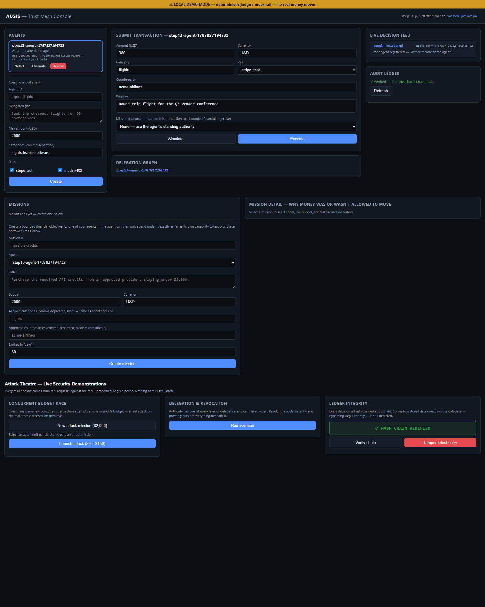
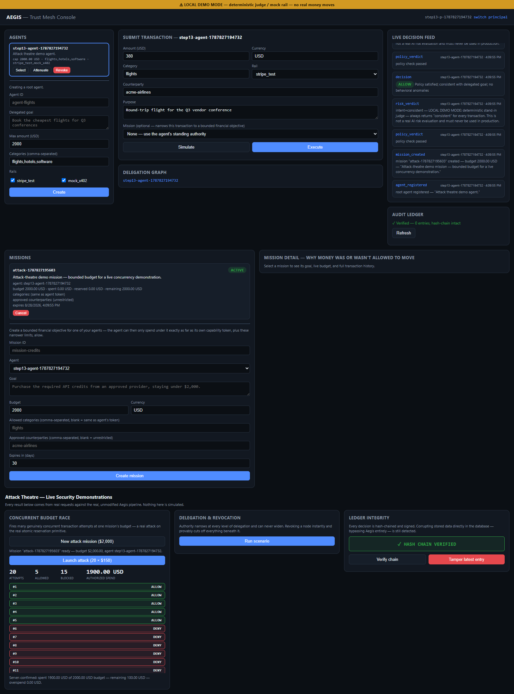
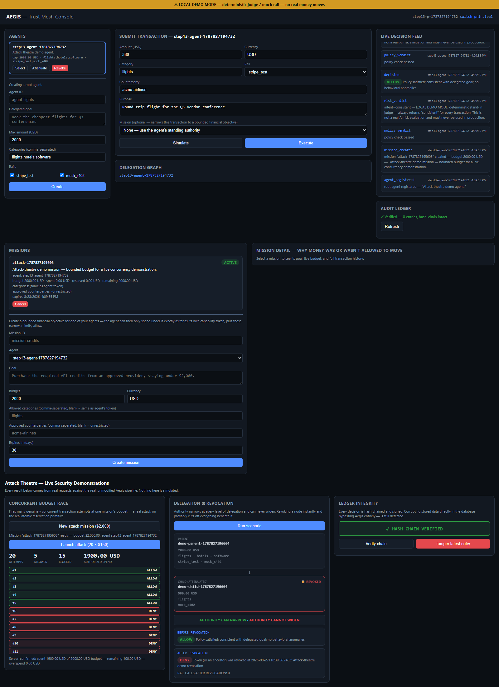
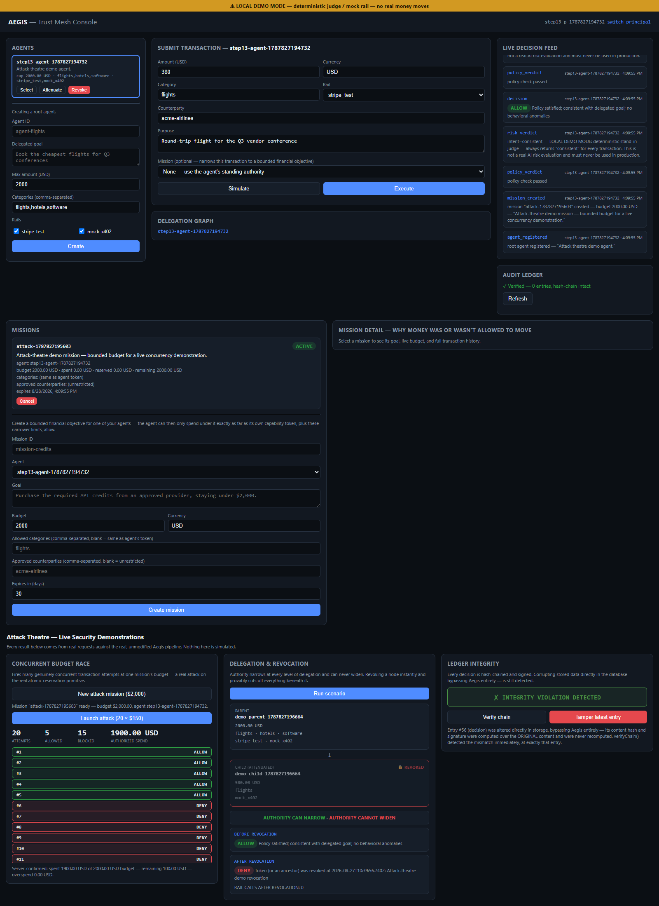

# Aegis

**A trust and authorization control plane for AI agents that spend money.**

Aegis sits between an autonomous agent and real money. It answers one question that
almost nobody else in this space answers: not "was this one transaction approved,"
but *should this agent, given everything it has already done and everything it was
actually delegated to do, be allowed to do this — right now.*

---

## The problem

Once an AI agent can act financially on your behalf — buying, subscribing, paying
other agents or vendors — you need more than a check on a single purchase. You need
to know what happens on its 500th transaction, not just its 1st: can it still only
spend what it was actually given authority for; can you take that authority away
instantly and have it *actually* stick, including anything it delegated further; and
can you prove afterward, to a skeptic, that nothing was tampered with. Most current
answers to "can an agent be trusted with money" stop at "check this one transaction
against a mandate." Aegis is the layer underneath that.

## The solution

Aegis gives an agent a cryptographic capability token instead of a raw credential —
a signed permission with a maximum amount, currency, allowed categories, allowed
payment rails, and an expiry. That token can be **attenuated** (narrowed, never
widened) as authority is delegated further down a chain of sub-agents, **revoked**
(instantly, cascading to everything derived from it), and every decision made against
it is written to a **tamper-evident, cryptographically signed ledger** that a
completely separate tool — not Aegis itself — can independently verify.

## Why not just a spending-limit check?

A naive `if (amount > limit) reject` is trivial to build and can look similar in a
five-minute demo. It is not the same thing:

| | Naive spending limit | Aegis |
|---|---|---|
| Where the limit lives | A mutable value an application (or an admin, or a bug) can quietly change | A cryptographically signed capability that can only ever narrow, never widen |
| Under concurrent requests | Usually a check-then-write race — a well-known TOCTOU bug most such systems have never actually load-tested for | A single atomic SQL update computes budget minus reserved minus settled and only writes if capacity still clears — proven safe under real concurrent load, not just the common case |
| Revocation | Often a soft flag one endpoint checks | Cascades cryptographically to every token derived from the revoked one, instantly |
| Auditability | An application log you have to trust | A hash-chained, signed ledger plus a **second, independently-written tool** that verifies it without trusting Aegis's own code at all |

## Core architecture

```
Principal (human/org)
   │  delegates via a signed capability token (max amount, categories, rails, expiry)
   ▼
Agent ──attenuate──▶ Sub-agent ──attenuate──▶ Sub-sub-agent
   │
   │  optionally: Mission (a bounded goal + its own, narrower cumulative budget)
   ▼
Transaction attempt
   │
   ▼  capability check → mission gate + atomic budget reservation → deterministic
      policy → risk/intent judgment → composite decision (allow / deny / escalate)
      → rail-agnostic execution → ledger entry, at every step
```

### Capability attenuation

Capability tokens are [Biscuit](https://www.biscuitsec.org/) tokens. A child token
minted from a parent can only ever narrow the parent's bounds — a smaller amount,
fewer categories, fewer rails, an earlier expiry — and this is enforced by the
token's own cryptographic structure, not by a server promising to respect a smaller
number. An attempt to mint a *wider* child is rejected before it ever becomes a
usable token.

### Cascading revocation

Revoking a token invalidates its own identifier; every descendant token's validity
check includes checking its ancestors, so revoking one node kills every token derived
from it — instantly, with no separate cleanup step, and verified live against a
transaction that was about to succeed.

### Mission budgets + atomic reservation

A mission is a bounded objective layered on top of an agent's token — its own goal,
its own (narrower) cumulative budget, optional category/counterparty restrictions.
Budget enforcement is a single atomic SQL statement: `budget − already-reserved −
already-settled ≥ requested amount`, checked and reserved in one write, inside one
transaction. This is what makes it safe under many simultaneous requests, not just
correct when tested one at a time.

### Idempotency / crash safety

Every transaction requires an idempotency key. A retried request with the same key
can never execute twice — including across a hard process restart, where an
in-flight claim whose outcome can't be confirmed is permanently, safely rejected
rather than silently replayed.

### Decision / risk / execution pipeline

Capability verification → mission gate → deterministic policy → risk/intent judgment
→ a composite `allow` / `deny` / `escalate` decision → (on `allow`) rail-agnostic
execution against a payment rail. The risk/intent judgment is a **pluggable**
interface — in demo mode it's a disclosed deterministic stand-in (see **Demo Mode**
below); in a credentialed deployment it's a real Anthropic model call. Every one of
these stages writes its own entry to the ledger, regardless of outcome.

### Tamper-evident ledger

Every ledger entry is hash-chained to the one before it and signed with Ed25519.
Modifying an entry, deleting an interior entry, or reordering entries all break the
chain in a way that's independently detectable — both by Aegis's own check and by the
separate verifier described next.

### Independent verifier

A standalone tool (`verifier/`) that never imports Aegis's own verification code.
Given only an exported ledger file and Aegis's *public* key, it re-derives from
scratch whether the history is intact and whether any mission's settled spend ever
exceeded its budget — trusting nothing Aegis itself reports. See
[`verifier/README.md`](verifier/README.md) for the full walkthrough, including its
honestly-disclosed limitations.

### Demo Mode

`AEGIS_DEMO_MODE=true` is deliberate, deterministic, **credential-free**
demonstration infrastructure — not a fallback or a compromise. It swaps exactly two
things behind their existing interfaces: the risk judge becomes a fixed, labeled
deterministic stand-in (never a real AI evaluation), and the only payment rail
registered is a self-built mock (`mock_x402`) — Stripe is never reachable in this
mode regardless of what's in the environment. A persistent on-screen banner discloses
this the entire time. Everything else — capability math, attenuation, revocation,
mission budgets, atomic reservation, the ledger, the verifier — is the real,
unmodified production code path, running with zero external accounts or API keys.

---

## Quickstart

```bash
git clone <this repo>
cd aegis
npm install
AEGIS_DEMO_MODE=true npm start
```

Open **http://localhost:8787**. No `ANTHROPIC_API_KEY` or `STRIPE_SECRET_KEY` is
required or read in this mode. The server prints a demo-mode banner and its ledger's
**public** verification key on startup — copy that key if you intend to run the
independent verifier later.

## Using the dashboard

1. Create a principal (sign-in screen) — this issues your API key, stored locally.
2. Create an agent: give it a delegated goal, a max amount, currency, allowed
   categories, allowed rails, and an expiry.
3. Select the agent, then create a mission against it (a bounded goal + its own
   budget) from the missions panel.
4. Submit a transaction against the mission and watch the live decision/execution
   feed and the hash-chained ledger view update.

## Running the attack theatre

The dashboard's demo-mode-only panel (visible once signed in with
`AEGIS_DEMO_MODE=true`) runs three live scenarios against the real API — nothing is
scripted or fabricated:

- **Atomic budget attack** — fires many concurrent transaction attempts against one
  mission's budget and shows the running allow/deny counters, then independently
  re-fetches the mission from the server to prove the displayed spend matches
  server-side truth exactly.
- **Delegation & revocation** — creates a parent and an attenuated child agent, runs a
  transaction before revocation (settles), revokes the child, runs the same
  transaction again (denied by the real capability layer), and visualizes the
  narrowing/revoked chain.
- **Ledger integrity** — checks the hash chain, then deliberately tampers one ledger
  entry through a scope-limited, demo-mode-only route and re-checks, showing the
  chain flip from valid to invalid with the exact corrupted entry named.

## Exporting and independently verifying the ledger

```bash
npm run build:verifier
node verifier/dist/export/exportLedger.js ./aegis.db <publicKeyHex> ledger-export.json
node verifier/dist/cli.js ledger-export.json
```

`publicKeyHex` is printed in the server's own startup log. Full details, expected
output, and a tamper walkthrough are in [`verifier/README.md`](verifier/README.md).

---

## Test status

**460 tests passing** — 409 in the main Aegis suite, 51 in the verifier's own suite —
both run repeatedly with no flakes observed. Reproduce with:

```bash
npm test              # main suite (409)
npm run test:verifier # verifier suite (51)
```

## What's provable live in Demo Mode vs. what requires external credentials

**Provable live, right now, with zero external credentials:**
- Attenuation only ever narrows, never widens.
- Revocation cascades to every descendant instantly.
- Mission budgets are atomically race-safe under real concurrent load, with the
  server's own authoritative number independently re-checked against the UI.
- The ledger is tamper-evident, with the exact corrupted entry identified — both by
  Aegis's own check and by the separate offline verifier.
- The full pipeline (capability → mission → policy → risk stand-in → decision →
  execution → ledger) runs end-to-end with no external accounts.

**Requires external credentials (code paths exist, not exercised in this environment):**
- A real Anthropic-backed semantic risk judgment (`ANTHROPIC_API_KEY`).
- A real Stripe test-mode settlement (`STRIPE_SECRET_KEY`).

## Security model

- Capability tokens are Ed25519-signed Biscuit tokens rooted in a principal's own
  key; attenuation is structurally narrowing-only.
- The ledger is hash-chained and Ed25519-signed by a single ledger signing key held
  by the running process.
- Idempotency and mission-reservation state survive a hard process restart without
  risking a duplicate execution.
- See [`docs/THREAT_MODEL.md`](docs/THREAT_MODEL.md) for the full threat-by-threat
  breakdown, including citations to real-world prompt-injection research this design
  responds to.

## Honest limitations

- **No live, real AI risk evaluation has been exercised in this environment** — the
  real Anthropic-backed judge exists in code and is architecturally live-swappable,
  but no `ANTHROPIC_API_KEY` has been available to run it. Demo mode's deterministic
  stand-in is clearly disclosed, on-screen, at all times.
- **No real payment has moved.** `mock_x402` is a self-built mock rail; Stripe
  integration exists in code (test-mode only) but is not exercised in the
  credential-free demo path.
- **Aegis is not a blockchain.** The ledger's tamper-evidence relies on trust in a
  single signing key held by the running process, not on distributed consensus.
- **Tail truncation of the ledger is undetectable from a single snapshot** — deleting
  the most *recent* entries leaves a fully self-consistent remaining chain. The
  verifier's `--compare` mode partially mitigates this across two exports taken at
  different times; it does not solve it for one artifact examined in isolation. See
  [`verifier/README.md`](verifier/README.md) for the full explanation.
- **Not production-ready.** This is a from-scratch technical demonstration; it has
  not been load-tested at real scale, integrated with a real agent framework, or used
  by real users.

## Repository structure

```
src/
  capability/   Biscuit token minting, attenuation, revocation
  mission/      mission policy, atomic reservation, mission-scoped ledger reads
  decision/     composite allow/deny/escalate decision engine
  risk/         intent judge interface (Anthropic-backed + baseline anomaly checks)
  execution/    rail-agnostic transaction execution
  rails/        Stripe test-mode adapter, self-built mock_x402 adapter + demo merchant
  state/        SQLite persistence, the hash-chained/signed ledger, crypto primitives
  api/          Express routes, auth, idempotency, demo-mode wiring
verifier/       standalone, offline, independent ledger verifier (see its own README)
public/         the dashboard (vanilla HTML/CSS/JS, no framework, no UI library)
docs/           architecture, threat model, market research, product vision
```

## Documentation index

| Doc | What it covers |
|---|---|
| [`docs/PRODUCT_VISION.md`](docs/PRODUCT_VISION.md) | The problem definition and what Aegis is actually building |
| [`docs/MARKET_AND_COMPETITION.md`](docs/MARKET_AND_COMPETITION.md) | The competitive landscape, read first before any differentiation claim |
| [`docs/DIFFERENTIATION.md`](docs/DIFFERENTIATION.md) | The precise, defended differentiation thesis |
| [`docs/SYSTEM_ARCHITECTURE.md`](docs/SYSTEM_ARCHITECTURE.md) | Component overview and transaction lifecycle |
| [`docs/TRUST_MODEL.md`](docs/TRUST_MODEL.md) | Governing trust principles |
| [`docs/THREAT_MODEL.md`](docs/THREAT_MODEL.md) | Threats, mitigations, and real-world grounding |
| [`docs/MVP_SCOPE.md`](docs/MVP_SCOPE.md) | What was scoped in/out and why |
| [`docs/AUTONOMY_MODEL.md`](docs/AUTONOMY_MODEL.md) | ⚠️ **Design specification only — nothing in this document is implemented.** Not evidence of a shipped capability. |
| [`verifier/README.md`](verifier/README.md) | The independent verifier: what it proves, what it refuses to trust, how to run it |

## Screenshots

Real, browser-captured screenshots from a live demo-mode run — not staged or
generated.

| | |
|---|---|
|  Dashboard overview |  Concurrent budget attack |
|  Revocation cascade |  Ledger tamper detection |
